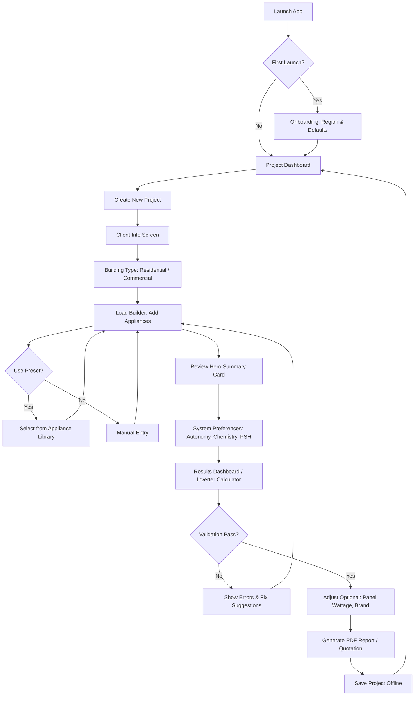
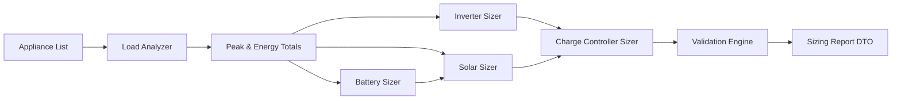
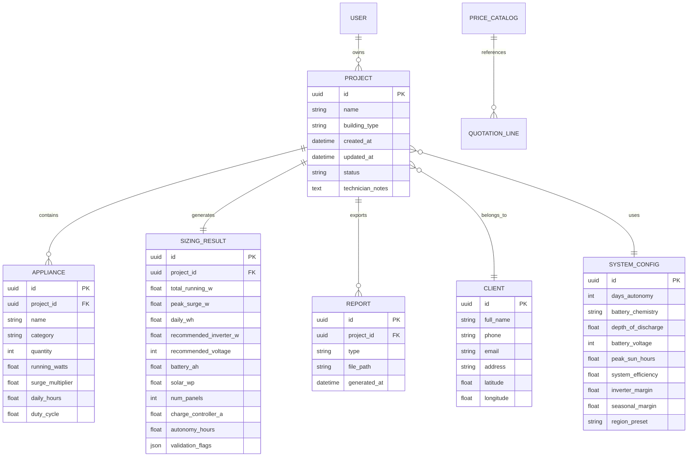
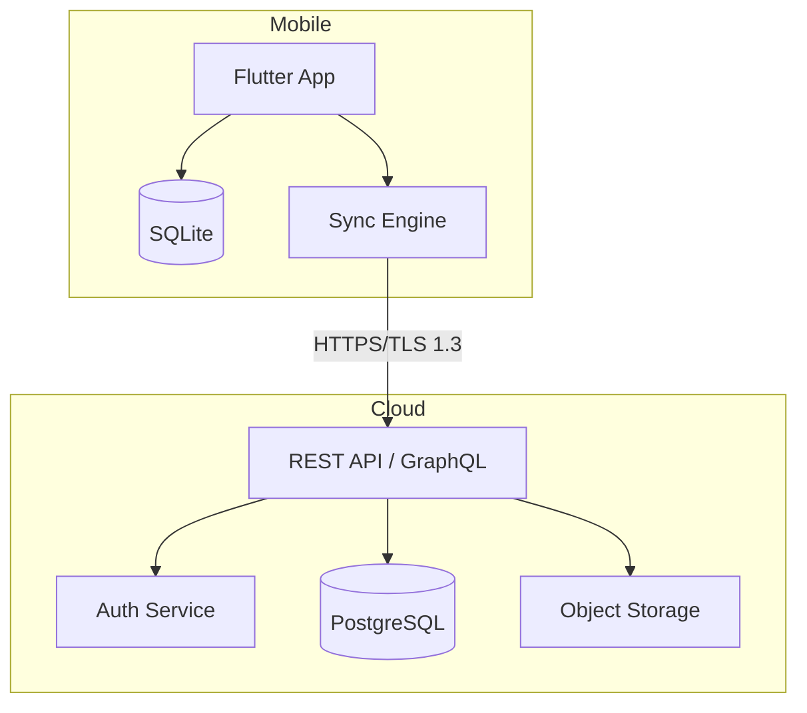
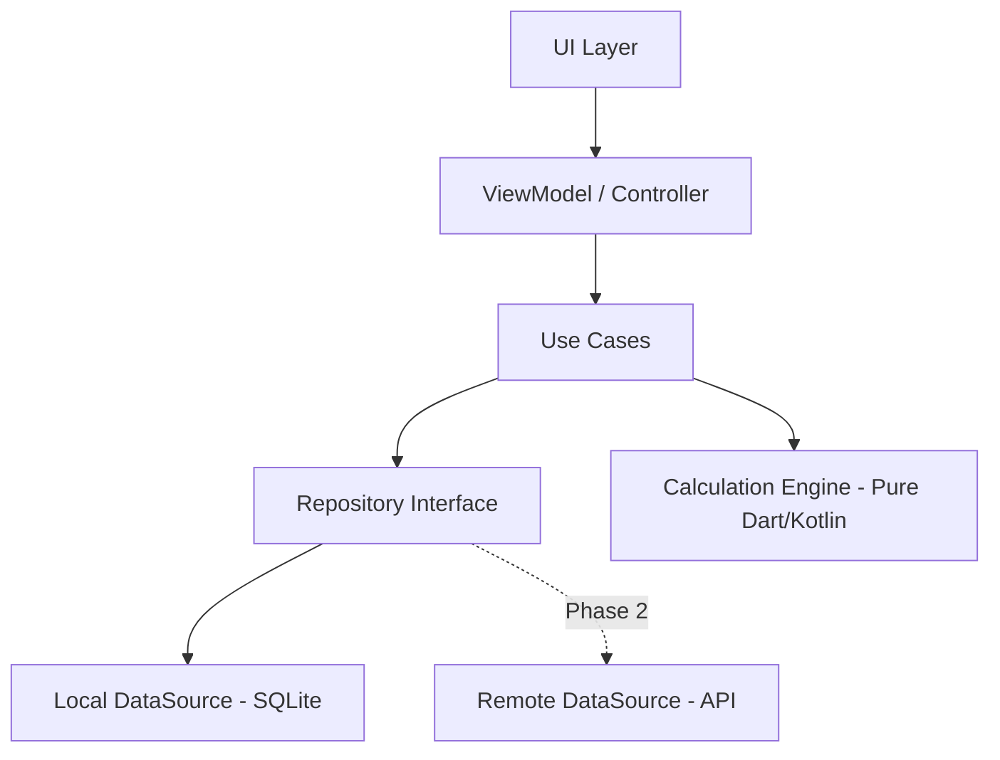
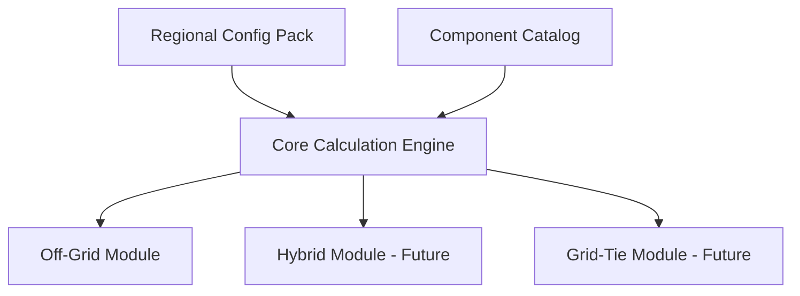
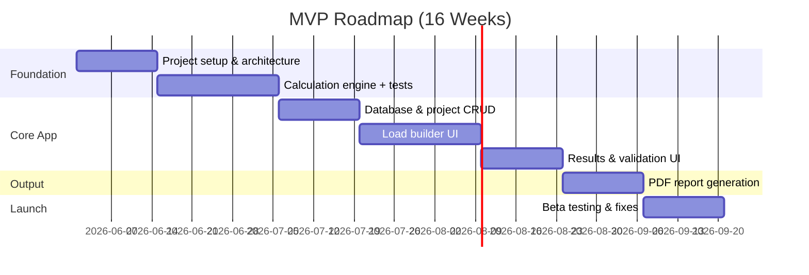

# Product Requirements Document (PRD)

## Inverter Engineering Pro — Off-Grid Solar & Inverter Sizing Mobile Application

| Field | Value |
|-------|-------|
| **Document Version** | 1.0.0 |
| **Status** | Draft — Ready for Development |
| **Target Platform** | Android (primary), iOS (phase 2) |
| **Primary Market** | Nigeria & Sub-Saharan Africa |
| **System Type** | Off-grid only (no national grid assumptions) |
| **Last Updated** | 2026-05-16 |

---

## Table of Contents

1. [App Overview](#1-app-overview)
2. [Core Features](#2-core-features)
3. [User Flow](#3-user-flow)
4. [Calculation Logic](#4-calculation-logic)
5. [Electrical Engineering Formulas](#5-electrical-engineering-formulas)
6. [Database Structure](#6-database-structure)
7. [UI/UX Design Recommendations](#7-uiux-design-recommendations)
8. [Recommended Tech Stack](#8-recommended-tech-stack)
9. [API Architecture](#9-api-architecture)
10. [Offline Storage Strategy](#10-offline-storage-strategy)
11. [PDF Report Structure](#11-pdf-report-structure)
12. [Future Scalability Features](#12-future-scalability-features)
13. [Security Considerations](#13-security-considerations)
14. [Deployment Strategy](#14-deployment-strategy)
15. [Monetization Ideas](#15-monetization-ideas)
16. [Sample Calculation Scenario](#16-sample-calculation-scenario)
17. [Recommended Folder Structure](#17-recommended-folder-structure)
18. [MVP Development Roadmap](#18-mvp-development-roadmap)

---

## 1. App Overview

### 1.1 Product Vision

**Inverter Engineering Pro** is a professional-grade mobile application that enables solar and inverter installation engineers to perform accurate off-grid system sizing, generate client-ready reports, and manage multiple installation projects — entirely usable in the field without internet connectivity.

The app addresses a critical gap in African markets where unstable grid supply drives demand for residential and commercial backup/off-grid systems, yet field engineers often rely on spreadsheets, memory, or vendor-supplied sizing charts that lack safety margins, surge accounting, and regional solar irradiance data.

### 1.2 Problem Statement

| Pain Point | Impact |
|------------|--------|
| Manual load calculations prone to error | Undersized inverters, failed startups on AC/refrigerators |
| No standardized surge multipliers | Client complaints, warranty claims |
| Inconsistent battery autonomy assumptions | Systems fail during cloudy weeks |
| Undersized solar arrays | Batteries never reach full charge |
| No professional documentation | Lost sales, disputes over specifications |
| No offline tools at job sites | Engineers cannot size on-site |

### 1.3 Target Users

| Persona | Description | Primary Goals |
|---------|-------------|---------------|
| **Field Engineer** | Installs inverters/solar for homes, shops, clinics | Fast sizing, PDF quotes, offline use |
| **Solar Consultant** | Designs off-grid systems for SMEs | Multi-project management, cost estimation |
| **Installation Company Owner** | Manages team and branding | Branded reports, technician notes |
| **Rural Electrification Technician** | Off-grid mini-systems | Simple UX, autonomy-focused sizing |

### 1.4 Scope Boundaries

**In scope (MVP & v1):**
- Off-grid inverter + battery + solar + charge controller sizing
- Residential and commercial load profiles
- PDF installation reports and quotations (NGN)
- Offline-first operation
- Project save/load

**Explicitly out of scope (v1):**
- Grid-tie / hybrid systems
- Net metering
- Real-time IoT monitoring
- National grid import/export assumptions

### 1.5 Success Metrics

| KPI | Target (6 months post-launch) |
|-----|-------------------------------|
| Calculation accuracy vs. manual audit | ≥ 98% match on benchmark scenarios |
| Offline session success rate | ≥ 99.5% |
| Time to complete full sizing | < 8 minutes |
| PDF generation success | ≥ 99% |
| Engineer NPS | ≥ 45 |

---

## 2. Core Features

### 2.1 Feature Matrix

| Feature | Priority | MVP | Description |
|---------|----------|-----|-------------|
| Appliance load builder | P0 | ✅ | Add appliances with qty, W, hours, surge |
| Load analysis dashboard | P0 | ✅ | Running load, peak surge, Wh/day, kWh/day |
| Inverter recommendation | P0 | ✅ | Sized with 20–30% headroom, voltage class |
| Battery bank sizing | P0 | ✅ | Ah, kWh, autonomy, DoD, chemistry options |
| Solar array sizing | P0 | ✅ | Wp, panel count, PSH, efficiency losses |
| Charge controller sizing | P0 | ✅ | MPPT/PWM recommendation, current rating |
| Autonomy calculator | P0 | ✅ | Days of backup at given load |
| Configuration validation | P0 | ✅ | Block/warn on impossible configs |
| Project management | P0 | ✅ | CRUD projects with client metadata |
| PDF installation report | P0 | ✅ | Branded professional output |
| PDF quotation (NGN) | P1 | ✅ | Line-item cost estimate |
| Installation checklist | P1 | ✅ | Printable task list |
| Appliance preset library | P1 | ✅ | TVs, fridges, ACs, pumps, etc. |
| Battery recharge time estimate | P1 | ✅ | Hours to full from solar |
| Standalone Inverter Calculator| P1 | ✅ | Quick verify battery configs & runtime |
| Standalone Solar Calculator| P1 | ✅ | Panel & MPPT sizing with load factors |
| Dark/light mode | P1 | ✅ | System + manual toggle |
| Multi-language | P2 | ⬜ | English, Hausa, Yoruba, Igbo, French |
| Cloud sync | P2 | ⬜ | Optional backup |
| AI load suggestions | P3 | ⬜ | Predict appliances from building type |

### 2.2 Appliance Input Model

Each appliance entry supports:

| Field | Type | Validation | Notes |
|-------|------|------------|-------|
| `name` | string | Required | Free text or preset |
| `category` | enum | Required | lighting, cooling, kitchen, IT, security, industrial, other |
| `quantity` | integer | ≥ 1 | |
| `running_watts` | float | > 0 | Nameplate or measured |
| `surge_multiplier` | float | 1.0–6.0 | Default from preset; AC/fridge = 3–5× |
| `surge_watts` | float | Computed or override | `running_watts × surge_multiplier × qty` |
| `daily_hours` | float | 0–24 | Usage hours per day |
| `duty_cycle` | float | 0–1 | Optional; for cycling loads (fridge compressor) |
| `power_factor` | float | 0.5–1.0 | Default 1.0; motors may use 0.7–0.85 |
| `notes` | string | Optional | Technician field notes |

### 2.3 System Configuration Inputs

| Parameter | Default (Nigeria) | Range |
|-----------|-------------------|-------|
| Days of autonomy | 2 | 1–7 |
| Battery chemistry | LiFePO₄ | LiFePO₄, AGM, Tubular Lead-Acid |
| Depth of discharge (DoD) | 0.80 (Li) / 0.50 (Lead) | Chemistry-dependent |
| Battery system voltage | Auto | 12V, 24V, 48V |
| Peak sun hours (PSH) | 5.0 | 3.5–6.5 (regional presets) |
| System efficiency (solar path) | 0.75 | 0.65–0.85 |
| Inverter safety margin | 25% | 20–30% |
| Seasonal solar margin | 20% | 10–30% |
| Inverter efficiency | 0.90 | 0.85–0.95 |
| Charge controller efficiency | 0.95 | 0.90–0.98 |
| Currency | NGN (₦) | NGN, USD, GHS, KES |

### 2.4 Validation Rules (Configuration Guardrails)

The app **must block or strongly warn** when:

| Condition | Severity | Message |
|-----------|----------|---------|
| Recommended inverter < peak surge load | **Block** | Inverter cannot start largest motor load |
| Battery Ah below minimum for 1 day autonomy | **Warn** | Insufficient storage for overnight |
| Solar Wp < 80% of minimum charge requirement | **Warn** | Array may not recover daily consumption |
| 12V system selected with load > 1500 W continuous | **Warn** | Recommend 24V or 48V architecture |
| Total surge > 3× inverter continuous rating | **Block** | Physically unsafe configuration |
| DoD > chemistry maximum | **Block** | Will destroy battery bank |
| Panel Voc × strings > charge controller max | **Block** | Overvoltage damage risk |

---

## 3. User Flow

### 3.1 Primary Journey — New Project Sizing



### 3.2 Screen Inventory

| Screen ID | Name | Purpose |
|-----------|------|---------|
| `SCR-001` | Splash / Auth | Optional login (v2); offline skip |
| `SCR-002` | Dashboard | Project list, search, filters |
| `SCR-003` | Client Info | Name, phone, address, GPS (optional) |
| `SCR-004` | Load Calculator | Appliance list with hero summary card |
| `SCR-005` | Appliance Form | Add/edit single appliance |
| `SCR-006` | Preset Library | Searchable appliance templates |
| `SCR-007` | System Config | Autonomy, PSH, chemistry, margins |
| `SCR-009` | Validation Panel | Errors, warnings, engineering notes |
| `SCR-010` | Cost Estimator | Material costs in NGN |
| `SCR-011` | Report Preview | PDF preview before export |
| `SCR-012` | Settings | Theme, language, defaults, company branding |
| `SCR-013` | Installation Checklist | Tickable field checklist |
| `SCR-014` | Inverter Calculator | Standalone math for inverter/battery configurations |
| `SCR-015` | Solar Calculator | Standalone math for array/MPPT with active loads |

### 3.3 Secondary Flows

**Quick Recalculate:** Open saved project → edit load → recalculate → overwrite or version report.

**Duplicate Project:** Clone sizing for similar client (e.g., 3 identical shops).

**Export Share:** Share PDF via WhatsApp, email, or save to device storage.

---

## 4. Calculation Logic

### 4.1 Calculation Pipeline

All calculations run in a **pure, deterministic domain layer** (no UI dependencies) so results are unit-testable and identical offline/online.



### 4.2 Load Analysis

**Per appliance:**

```
running_load_w   = running_watts × quantity
surge_load_w     = surge_watts × quantity   (or running_watts × surge_multiplier × quantity)
daily_wh         = running_watts × quantity × daily_hours × duty_cycle
```

**Aggregates:**

```
total_running_load_w  = Σ running_load_w
total_surge_load_w    = Σ surge_load_w   (not all simultaneous — see surge policy)
peak_surge_load_w     = total_running_load_w + max(surge_load_w - running_load_w per appliance)
                        OR simultaneous surge policy (configurable, default: running + max incremental surge)
daily_energy_wh       = Σ daily_wh
daily_energy_kwh      = daily_energy_wh / 1000
```

**Surge policy (default — conservative):**
Assume all appliances are running, and only the **single largest motor surge** is added on top of total running load:

```
peak_surge_load_w = total_running_load_w + max(appliance_surge_w - appliance_running_w)
```

**Alternative policy (commercial, user-selectable):**
`simultaneous_surge` = sum of top N surge increments (N = 2 for commercial).

### 4.3 Inverter Sizing

```
adjusted_peak_w = peak_surge_load_w × (1 + inverter_safety_margin)
                  e.g., × 1.25 for 25% margin

recommended_inverter_va = adjusted_peak_w / power_factor_system
recommended_inverter_w  = ceil_to_standard_rating(adjusted_peak_w)

standard_ratings_w = [500, 1000, 1500, 2000, 2500, 3000, 5000, 6000, 8000, 10000, 15000, 20000]
```

**Voltage class selection logic:**

| Continuous Load | Recommended DC Bus |
|-----------------|-------------------|
| ≤ 1,000 W | 12V (acceptable) |
| 1,001 – 3,000 W | 24V |
| > 3,000 W | 48V |

**Output flags:**
- `requires_pure_sine_wave = true` if any appliance category ∈ {cooling, kitchen, IT, medical}
- `inverter_type` = "Pure Sine Wave" (always recommended for off-grid professional installs)

### 4.4 Battery Sizing

```
usable_energy_wh = daily_energy_wh × days_of_autonomy

battery_capacity_ah = usable_energy_wh / (battery_voltage × depth_of_discharge × battery_round_trip_efficiency)

battery_capacity_kwh = (battery_voltage × battery_capacity_ah) / 1000

autonomy_hours = (battery_capacity_ah × battery_voltage × DoD × efficiency) / total_running_load_w
```

**Round-trip efficiency defaults:**

| Chemistry | η_rt | Max DoD |
|-----------|------|---------|
| LiFePO₄ | 0.95 | 0.80 |
| AGM | 0.85 | 0.50 |
| Tubular Lead-Acid | 0.80 | 0.50 |

**Battery bank configuration:**
- Select series/parallel to match system voltage and Ah requirement
- Standard cell/battery voltages: 12V blocks
- `num_batteries = ceil(battery_capacity_ah / selected_battery_ah_rating)`

### 4.5 Solar Panel Sizing

```
adjusted_daily_wh = daily_energy_wh × (1 + seasonal_margin)

solar_array_w = adjusted_daily_wh / (PSH × system_efficiency)

num_panels = ceil(solar_array_w / selected_panel_wp)

actual_array_wp = num_panels × selected_panel_wp
```

Where:
```
system_efficiency = inverter_efficiency × charge_controller_efficiency × battery_charge_efficiency × cable_soiling_loss
default           = 0.90 × 0.95 × 0.95 × 0.92 ≈ 0.75
```

### 4.6 Charge Controller Sizing

**MPPT (preferred for >400 W arrays):**

```
charge_current_a = actual_array_wp / battery_voltage × 1.25  (safety factor)

recommended_cc_a = ceil_to_standard([20, 30, 40, 60, 80, 100])
```

**Voltage validation:**
```
panel_string_voc_cold = panel_voc × num_series × 1.15  (cold temperature factor)
must be ≤ controller_max_voc
```

### 4.7 Battery Recharge Time Estimate

```
solar_charge_power_w = actual_array_wp × system_efficiency
recharge_time_hours  = (battery_capacity_ah × battery_voltage × (1 - current_soc)) / solar_charge_power_w
```

### 4.8 Cost Estimation (Quotation)

```
total_cost_ngn = (inverter_cost + battery_cost + panel_cost + cc_cost + installation_labor + misc)
```

Costs pulled from editable **price catalog** (offline JSON, user-updatable).

---

## 5. Electrical Engineering Formulas

### 5.1 Reference Formula Sheet

| # | Name | Formula | Units |
|---|------|---------|-------|
| F1 | Running load | `P_run = Σ (P_i × n_i)` | W |
| F2 | Daily energy | `E_day = Σ (P_i × n_i × h_i × d_i)` | Wh |
| F3 | Peak surge (conservative) | `P_peak = P_run + max(P_surge_i - P_run_i)` | W |
| F4 | Inverter rating | `P_inv = P_peak × (1 + M_inv)` | W |
| F5 | Battery capacity | `C_Ah = (E_day × D_auto) / (V_bat × DoD × η_rt)` | Ah |
| F6 | Battery energy | `E_bat = V_bat × C_Ah / 1000` | kWh |
| F7 | Solar array | `P_pv = (E_day × (1 + M_season)) / (PSH × η_sys)` | W |
| F8 | Panel count | `N_pan = ⌈P_pv / P_panel⌉` | — |
| F9 | Charge current | `I_cc = P_pv / V_bat × 1.25` | A |
| F10 | Autonomy | `T_auto = (C_Ah × V_bat × DoD × η) / P_run` | h |
| F11 | DC current | `I_dc = P / V_bat` | A |
| F12 | Wire gauge (hint) | Based on `I_dc`, length, 3% drop | AWG/mm² |

### 5.2 Standard Surge Multipliers (Presets)

| Appliance | Running W (typical) | Surge Multiplier |
|-----------|--------------------:|-----------------:|
| LED TV 32" | 50 | 1.2× |
| Refrigerator (domestic) | 150 | 3.5× |
| Chest Freezer | 200 | 4.0× |
| Split AC 1HP | 900 | 3.0× |
| Split AC 1.5HP | 1400 | 3.0× |
| Ceiling Fan | 75 | 2.0× |
| Water Pump 0.5HP | 400 | 3.5× |
| Desktop Computer | 200 | 1.5× |
| CCTV System (8 cam) | 60 | 1.2× |
| WiFi Router | 12 | 1.1× |

### 5.3 Regional Peak Sun Hours (Presets)

| Location | Annual Avg PSH | Worst Month PSH | Recommended Design PSH |
|----------|----------------:|----------------:|-----------------------:|
| Lagos | 4.5 | 3.8 | 4.0 |
| Abuja | 5.5 | 4.5 | 5.0 |
| Kano | 6.0 | 5.0 | 5.5 |
| Port Harcourt | 4.0 | 3.2 | 3.5 |
| Nairobi | 5.0 | 4.0 | 4.5 |
| Accra | 4.8 | 4.0 | 4.5 |

**Design rule:** Use **worst-month PSH** for off-grid autonomy-critical systems, or apply seasonal margin on annual average.

### 5.4 Standard Component Rating Tables

**Inverter (W):** 500, 1000, 1500, 2000, 2500, 3000, 5000, 6000, 8000, 10000

**Solar panels (Wp):** 300, 350, 400, 450, 500, 550, 600

**Charge controller (A):** 20, 30, 40, 60, 80, 100

---

## 6. Database Structure

### 6.1 Entity Relationship Diagram



### 6.2 Local Database Schema (SQLite via Room / Drift)

**Table: `projects`**

| Column | Type | Notes |
|--------|------|-------|
| `id` | TEXT PK | UUID v4 |
| `name` | TEXT | Project display name |
| `building_type` | TEXT | residential, commercial |
| `client_id` | TEXT FK | |
| `config_id` | TEXT FK | |
| `status` | TEXT | draft, sized, quoted, installed |
| `technician_notes` | TEXT | |
| `created_at` | INTEGER | Unix ms |
| `updated_at` | INTEGER | Unix ms |
| `synced` | INTEGER | 0/1 for future cloud |

**Table: `appliances`**

| Column | Type |
|--------|------|
| `id` | TEXT PK |
| `project_id` | TEXT FK |
| `name` | TEXT |
| `category` | TEXT |
| `quantity` | INTEGER |
| `running_watts` | REAL |
| `surge_multiplier` | REAL |
| `daily_hours` | REAL |
| `duty_cycle` | REAL DEFAULT 1.0 |
| `sort_order` | INTEGER |

**Table: `sizing_results`**

| Column | Type |
|--------|------|
| `id` | TEXT PK |
| `project_id` | TEXT FK UNIQUE |
| `result_json` | TEXT | Full `SizingReportDTO` serialized |
| `calculated_at` | INTEGER |

**Table: `appliance_presets`**

| Column | Type |
|--------|------|
| `id` | TEXT PK |
| `name` | TEXT |
| `category` | TEXT |
| `running_watts` | REAL |
| `surge_multiplier` | REAL |
| `default_hours` | REAL |
| `is_builtin` | INTEGER |

**Table: `price_catalog`**

| Column | Type |
|--------|------|
| `id` | TEXT PK |
| `component_type` | TEXT |
| `rating` | TEXT |
| `unit_price_ngn` | REAL |
| `updated_at` | INTEGER |

### 6.3 Data Transfer Objects (Domain Layer)

```typescript
// Illustrative — language-agnostic contract
interface SizingReportDTO {
  loadAnalysis: {
    totalRunningW: number;
    peakSurgeW: number;
    dailyWh: number;
    dailyKwh: number;
  };
  inverter: {
    recommendedW: number;
    standardRatingW: number;
    safetyMarginPercent: number;
    systemVoltage: 12 | 24 | 48;
    pureSineWave: boolean;
    notes: string[];
  };
  battery: {
    capacityAh: number;
    capacityKwh: number;
    chemistry: string;
    depthOfDischarge: number;
    autonomyDays: number;
    autonomyHours: number;
    numBatteries: number;
    configuration: string; // e.g., "4S2P"
  };
  solar: {
    arrayWp: number;
    numPanels: number;
    panelRatingWp: number;
    peakSunHours: number;
    rechargeTimeHours: number;
  };
  chargeController: {
    type: 'MPPT' | 'PWM';
    recommendedAmps: number;
    maxVoc: number;
  };
  validation: ValidationFlag[];
  calculatedAt: string; // ISO 8601
}
```

---

## 7. UI/UX Design Recommendations

### 7.1 Design Principles

1. **Field-first:** Large tap targets (min 48dp), readable in sunlight, works one-handed.
2. **Progressive disclosure:** Show simple totals first; engineering detail on expand.
3. **Trust through transparency:** Display formulas and assumptions used.
4. **Fail-safe:** Validation errors in plain language, not error codes. Strict numeric-only keyboards to prevent parsing crashes.
5. **Offline confidence:** No spinner waiting for network; instant calculations.

### 7.2 Visual Design System

| Token | Light Mode | Dark Mode |
|-------|------------|-----------|
| Primary | `#1B5E20` (Solar Green) | `#4CAF50` |
| Secondary | `#F9A825` (Energy Amber) | `#FFD54F` |
| Background | `#FAFAFA` | `#121212` |
| Surface | `#FFFFFF` | `#1E1E1E` |
| Error | `#C62828` | `#EF5350` |
| Warning | `#EF6C00` | `#FFA726` |
| Success | `#2E7D32` | `#66BB6A` |

**Typography:** Inter or Roboto — 16sp body, 20sp section headers, tabular figures for numbers.

### 7.3 Key Screen Wireframe Notes

**Load Builder:**
- Hero Summary Card (Gradient): `Total Daily Energy`, `Running Load`, `Peak Surge Load`
- Swipe-to-delete appliances
- FAB: "Add Appliance"

**Results Dashboard:**
- Card layout: Inverter → Battery → Solar → Charge Controller
- Traffic-light validation strip at top
- CTA: "Generate Report" (primary), "Edit Load" (secondary)

**Appliance Form:**
- Stepper for quantity
- Slider for daily hours (0–24)
- Surge toggle: "Use preset" / "Custom watts"

### 7.4 Accessibility

- WCAG AA contrast ratios
- Screen reader labels on all inputs
- Support font scaling up to 200%
- Haptic feedback on validation errors

---

## 8. Recommended Tech Stack

### 8.1 Primary Recommendation (Cross-Platform, Fast MVP)

| Layer | Technology | Rationale |
|-------|------------|-----------|
| **Framework** | Flutter 3.x (Dart) | Single codebase, excellent PDF plugins, offline SQLite |
| **State Management** | Riverpod 2.x | Testable, compile-safe |
| **Local DB** | Drift (SQLite) | Type-safe, migrations |
| **PDF Generation** | `pdf` + `printing` packages | Offline PDF |
| **Navigation** | go_router | Deep linking ready |
| **Localization** | flutter_localizations + ARB files | Multi-language |
| **Testing** | flutter_test, mocktail | Unit + widget tests |

### 8.2 Alternative (Native Android)

| Layer | Technology |
|-------|------------|
| UI | Kotlin + Jetpack Compose |
| Architecture | MVVM + Clean Architecture |
| DI | Hilt |
| DB | Room |
| PDF | iText or PdfDocument API |

### 8.3 Backend (Optional — Phase 2)

| Layer | Technology |
|-------|------------|
| API | Node.js (NestJS) or Go (Fiber) |
| Auth | Firebase Auth or Supabase |
| DB | PostgreSQL |
| Storage | S3-compatible (report backup) |
| Sync | PowerSync or custom REST + CRDT |

### 8.4 Engineering Standards

- **Minimum Android SDK:** API 24 (Android 7.0) — covers 95%+ African devices
- **Target SDK:** Latest stable
- **CI:** GitHub Actions — lint, unit tests, build APK/AAB
- **Crash reporting:** Firebase Crashlytics (opt-in, requires network)

---

## 9. API Architecture

### 9.1 Phase 1 — Offline Only

No API required. All logic on-device.

### 9.2 Phase 2 — Optional Cloud Sync



### 9.3 REST Endpoints (Future)

| Method | Endpoint | Description |
|--------|----------|-------------|
| `POST` | `/v1/auth/login` | Engineer authentication |
| `GET` | `/v1/projects` | List projects (paginated) |
| `POST` | `/v1/projects` | Create project |
| `PUT` | `/v1/projects/:id` | Update project |
| `DELETE` | `/v1/projects/:id` | Soft delete |
| `POST` | `/v1/projects/:id/sync` | Upsert full project blob |
| `GET` | `/v1/presets/appliances` | Updated appliance library |
| `GET` | `/v1/catalog/prices` | Regional price catalog |
| `POST` | `/v1/reports/generate` | Server-side PDF (optional) |

### 9.4 Sync Strategy

- **Last-write-wins** per project with `updated_at` timestamp
- Conflict resolution UI if same project edited on two devices
- Sync queue stored locally; retry with exponential backoff

---

## 10. Offline Storage Strategy

### 10.1 Offline-First Architecture



### 10.2 What Is Stored Locally

| Data | Storage | Size Estimate |
|------|---------|---------------|
| Projects & appliances | SQLite | < 5 MB for 500 projects |
| Sizing results | SQLite (JSON blob) | < 1 MB |
| PDF reports | File system (`/reports/`) | 200 KB–2 MB each |
| Appliance presets | SQLite + seed JSON | < 100 KB |
| Price catalog | SQLite | < 50 KB |
| User settings | SharedPreferences / DataStore | < 10 KB |
| Company branding (logo) | File system | < 500 KB |

### 10.3 Migrations

- Versioned schema migrations (Drift/Room)
- Export/import full database as encrypted ZIP (backup)

### 10.4 Cache Invalidation

- Presets: refresh on app update or manual "Update catalog"
- Calculations: always recomputed from source data (never stale cache)

---

## 11. PDF Report Structure

### 11.1 Installation Report (Professional)

**Page 1 — Cover**
- Company logo & name
- Report title: "Off-Grid Solar & Inverter System Proposal"
- Client name, address, date
- Project reference ID
- Engineer name & contact

**Page 2 — Executive Summary**
- Recommended system at a glance (inverter W, battery Ah, solar Wp)
- Estimated autonomy (days/hours)
- Total estimated cost (NGN)
- Key assumptions (PSH, DoD, margins)

**Page 3 — Load Analysis Table**

| Appliance | Qty | Watts | Hours/day | Wh/day |
|-----------|-----|-------|-----------|--------|
| ... | | | | |
| **Total** | | **Running: X W** | | **X Wh** |

**Page 4 — System Sizing**

| Component | Recommended | Notes |
|-----------|-------------|-------|
| Inverter | X W Pure Sine | 25% safety margin |
| Battery Bank | X Ah @ X V | LiFePO₄, 2-day autonomy |
| Solar Array | X Wp (N × X Wp panels) | PSH = 5.0 |
| Charge Controller | X A MPPT | |

**Page 5 — Single-Line Diagram (Simplified)**

```
[PV Array] → [Charge Controller] → [Battery Bank] → [Inverter] → [AC Loads]
```

**Page 6 — Installation Checklist**
- Mounting, grounding, fuse sizing, cable routing
- Commissioning steps
- Client handover sign-off block

**Page 7 — Terms & Disclaimer**
- Assumptions limited to off-grid
- Actual performance varies with weather and usage
- Engineer sign-off line

### 11.2 Quotation Format

| Item | Spec | Qty | Unit (₦) | Total (₦) |
|------|------|-----|----------|-----------|
| Pure Sine Inverter | 3000 W | 1 | | |
| LiFePO₄ Battery | 200 Ah × 24V | 4 | | |
| Solar Panel | 450 Wp | 8 | | |
| MPPT Controller | 60 A | 1 | | |
| Installation & Cabling | — | 1 | | |
| **Grand Total** | | | | **₦** |

---

## 12. Future Scalability Features

### 12.1 Roadmap Tiers

| Tier | Features |
|------|----------|
| **v2.0 Hybrid** | Grid-tie, ATS, generator integration |
| **v2.1 IoT** | MQTT/BLE monitoring, live SOC, alerts |
| **v2.2 AI** | Load prediction from building type; panel shading analysis from photo |
| **v2.3 Enterprise** | Team accounts, role-based access, white-label |
| **v2.4 Integrations** | Victron, Growatt, Deye API for live specs |

### 12.2 Extensibility Architecture

- **Plugin-based calculation modules** — `ICalculationModule` interface
- **Regional config packs** — JSON bundles for PSH, tariffs, currencies
- **Component library API** — Third-party manufacturers submit spec sheets
- **Feature flags** — Remote config for gradual rollouts



---

## 13. Security Considerations

| Area | Requirement |
|------|-------------|
| **Data at rest** | SQLCipher or Android Keystore for sensitive client data |
| **PDF storage** | App-private directory; no world-readable exports |
| **Authentication (v2)** | OAuth 2.0 / JWT; refresh token rotation |
| **API transport** | TLS 1.3, certificate pinning |
| **Input validation** | Strict numeric-only filtering for calculation fields; sanitize text fields |
| **Backup export** | Password-protected ZIP for project backup |
| **PII** | Client phone/address — GDPR-style delete on request |
| **Permissions** | Request storage/camera only when needed; rationale shown |
| **Code integrity** | Play Integrity API for licensed features |

---

## 14. Deployment Strategy

### 14.1 Release Channels

| Channel | Audience | Cadence |
|---------|----------|---------|
| Internal testing | Dev team | Continuous |
| Closed beta | 20–50 engineers | 4 weeks |
| Open beta | Play Store Beta | 4 weeks |
| Production | Play Store | Monthly releases |

### 14.2 Play Store Requirements

- Target API 34+
- App bundle (AAB)
- Privacy policy URL
- Data safety form (declare client data collected)
- Screenshots: phone + 7" tablet
- Localized listing: English (primary)

### 14.3 Distribution Alternatives

- Direct APK for enterprise clients (signed, versioned)
- MDM deployment for installation companies

### 14.4 CI/CD Pipeline

```yaml
# Conceptual pipeline
on: [push, pull_request]
jobs:
  test:
    - flutter analyze
    - flutter test
  build:
    - flutter build appbundle --release
    - upload artifact
  deploy:
    - deploy to Play Store Internal Track (on tag)
```

---

## 15. Monetization Ideas

| Model | Description | Price Point (NGN) |
|-------|-------------|-------------------:|
| **Freemium** | 3 free projects; unlimited on Pro | ₦2,500/mo or ₦20,000/yr |
| **One-time Pro** | Lifetime license | ₦35,000 |
| **Company License** | 5 seats, branded PDF | ₦120,000/yr |
| **Catalog sponsorship** | Manufacturers pay for preset placement | B2B |
| **Lead generation** | Refer qualified leads to distributors | Commission |
| **Training bundle** | App + certification course | ₦50,000 |

**Free tier must allow** full calculations to drive adoption; gate PDF branding, project count, and cloud sync.

---

## 16. Sample Calculation Scenario

### 16.1 Client Profile

**Client:** Small dental clinic, Lagos  
**Building type:** Commercial  
**Autonomy target:** 2 days  
**Battery chemistry:** LiFePO₄  
**PSH:** 4.0 (conservative Lagos worst-month)  
**System efficiency:** 0.75  

### 16.2 Appliance List

| Appliance | Qty | Running W | Surge × | Hours/day |
|-----------|-----|----------:|--------:|----------:|
| LED Lights | 20 | 15 | 1.0 | 10 |
| Desktop PC | 2 | 200 | 1.5 | 8 |
| Dental Chair Compressor | 1 | 800 | 3.0 | 4 |
| Refrigerator (vaccine) | 1 | 150 | 3.5 | 24 (duty 0.4) |
| Split AC 1.5HP | 1 | 1400 | 3.0 | 6 |
| CCTV | 1 | 60 | 1.2 | 24 |
| Router | 1 | 12 | 1.1 | 24 |

### 16.3 Load Analysis

```
Lights:       20 × 15 × 10       = 3,000 Wh
PCs:           2 × 200 × 8       = 3,200 Wh
Compressor:    1 × 800 × 4       = 3,200 Wh
Fridge:        1 × 150 × 24 × 0.4 = 1,440 Wh
AC:            1 × 1400 × 6      = 8,400 Wh
CCTV:          1 × 60 × 24       = 1,440 Wh
Router:        1 × 12 × 24       = 288 Wh
─────────────────────────────────────────
Daily Energy:                      20,968 Wh ≈ 21.0 kWh/day

Running Load: 20×15 + 2×200 + 800 + 150 + 1400 + 60 + 12 = 3,222 W
Max surge increment: Compressor 800×3 - 800 = 1,600 W (largest)
Peak Surge Load: 3,222 + 1,600 = 4,822 W
```

### 16.4 Inverter Recommendation

```
Adjusted peak = 4,822 × 1.25 = 6,028 W
Standard rating → 8,000 W Pure Sine Wave
System voltage → 48V (load > 3,000 W)
```

### 16.5 Battery Sizing

```
Usable energy = 21,000 × 2 days = 42,000 Wh
Battery Ah = 42,000 / (48 × 0.80 × 0.95) = 42,000 / 36.48 = 1,151 Ah @ 48V
Battery kWh = 48 × 1151 / 1000 = 55.2 kWh
Configuration: 16 × 280 Ah 12V LiFePO₄ in 4S4P (example)
Autonomy at running load: (1151 × 48 × 0.80 × 0.95) / 3222 = 13.0 hours continuous
```

### 16.6 Solar Sizing

```
Adjusted daily = 21,000 × 1.20 = 25,200 Wh
Solar Wp = 25,200 / (4.0 × 0.75) = 8,400 Wp
Panels (450 Wp) = ceil(8400/450) = 19 panels
Actual array = 19 × 450 = 8,550 Wp
```

### 16.7 Charge Controller

```
Charge current = 8550 / 48 × 1.25 = 223 A → Multiple controllers or string splitting
Recommend: 3 × 80 A MPPT (distributed strings)
Recharge time (from 50% SOC): (1151 × 48 × 0.5) / (8550 × 0.75) ≈ 4.3 hours ideal peak sun
```

### 16.8 Validation Summary

| Check | Status |
|-------|--------|
| Inverter 8 kW > peak 4.8 kW × 1.25 | ✅ Pass |
| 48V architecture for 3.2 kW running | ✅ Pass |
| Solar meets 120% daily energy | ✅ Pass (8.5 kW >> min) |
| Battery supports 2-day autonomy | ✅ Pass |

---

## 17. Recommended Folder Structure

```
SolarPro/
├── blueprint/                          # Flutter root
│   ├── docs/
│   │   ├── PRD.md                      # Product Requirements
│   │   ├── Load calculator prompt.md   # AI recreation prompt
│   │   ├── inverter calculator prompt.md # AI recreation prompt
│   │   └── Solar calculator prompt.md  # AI recreation prompt
│   ├── lib/
│   │   ├── main.dart
│   │   ├── data/
│   │   │   ├── datasources/
│   │   │   │   └── local/
│   │   │   │       ├── app_database.dart
│   │   │   │       └── app_database.g.dart
│   │   │   └── repositories/
│   │   │       └── database_repository.dart
│   │   ├── domain/
│   │   │   └── entities/
│   │   │       └── appliance.dart
│   │   ├── engine/                     # Pure Calculation Logic
│   │   │   ├── battery_sizer.dart
│   │   │   ├── inverter_sizer.dart
│   │   │   ├── load_analyzer.dart
│   │   │   └── solar_sizer.dart
│   │   ├── presentation/
│   │   │   ├── providers/
│   │   │   │   ├── appliance_provider.dart
│   │   │   │   └── database_provider.dart
│   │   │   ├── router/
│   │   │   │   └── app_router.dart
│   │   │   ├── screens/
│   │   │   │   ├── inverter_calculation_screen.dart
│   │   │   │   ├── load_analyzer_screen.dart
│   │   │   │   ├── main_screen.dart
│   │   │   │   ├── projects_screen.dart
│   │   │   │   └── solar_calculation_screen.dart
│   │   │   └── widgets/
│   │   │       └── app_drawer.dart
│   │   └── services/
│   │       └── pdf/
│   │           └── report_generator.dart
│   └── test/
│       └── engine/
│           ├── battery_sizer_test.dart
│           └── load_analyzer_test.dart
```

---

## 18. MVP Development Roadmap

### 18.1 Phase Overview



### 18.2 Sprint Breakdown

| Sprint | Weeks | Deliverables |
|--------|-------|--------------|
| **S1** | 1–2 | Repo setup, CI, theme, navigation, domain entities |
| **S2** | 3–5 | Calculation engine (all formulas), 20+ unit tests, benchmark scenarios |
| **S3** | 6–7 | SQLite schema, project CRUD, appliance presets seed |
| **S4** | 8–10 | Load builder UI, preset library, sticky totals |
| **S5** | 11–12 | Results screen, validation engine UI, system config |
| **S6** | 13–14 | PDF installation report + quotation, share sheet |
| **S7** | 15–16 | Beta, bug fixes, Play Store submission |

### 18.3 MVP Definition of Done

- [ ] Engineer can create project, add 10+ appliances, get full sizing
- [ ] All calculations match `CALCULATION_SPEC.md` test vectors
- [ ] Validation blocks unsafe inverter undersizing
- [ ] PDF exports offline with company name
- [ ] 3 sample projects persist after app restart
- [ ] App runs on Android 7.0+ without crashes in 1-hour field test
- [ ] Dark mode functional
- [ ] NGN quotation with editable price catalog

### 18.4 Post-MVP Priorities (v1.1 – v1.3)

1. Multi-language (Hausa, Yoruba, Igbo)
2. Cloud sync & account login
3. Installation checklist with photo attachments
4. iOS release
5. AI appliance suggestions by building type

---

## Appendix A — Glossary

| Term | Definition |
|------|------------|
| **PSH** | Peak Sun Hours — equivalent full-sun hours per day |
| **DoD** | Depth of Discharge — fraction of battery capacity used |
| **Wp** | Watt-peak — solar panel rated output under STC |
| **MPPT** | Maximum Power Point Tracking charge controller |
| **Autonomy** | Duration system runs without solar input |
| **Surge** | Inrush current during motor/compressor startup |

## Appendix B — References

- IEC 60364 — Low-voltage electrical installations
- IEC 62548 — PV array design requirements
- Sandia National Laboratories — Battery sizing methodologies
- NREL Solar Resource Data — Regional irradiance references

---

*End of Document*
